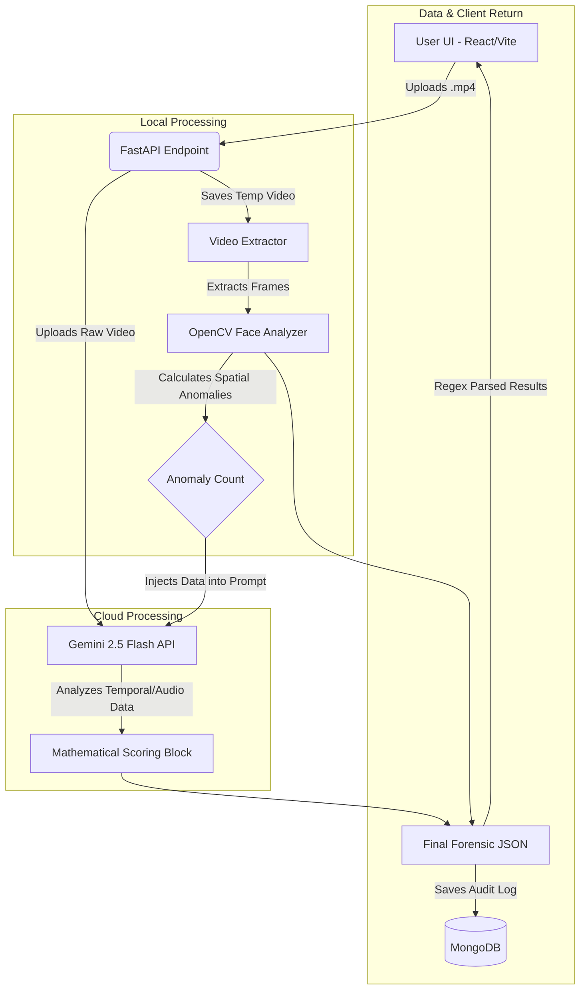

# 🛡️ Hackwizards Sentinel: Advanced Deepfake Analyzer


## ⚠️ The Problem Statement
Modern generative AI (like Sora, Midjourney, and Runway) has evolved past generating static deepfakes. Today's AI can generate temporally consistent video, making traditional frame-by-frame image analysis obsolete. When standard detection models look at static frames, the "perfect" AI skin and lighting fool them into reporting "Authentic Media." A new, dynamic approach is required to catch spatial morphing, lip-sync misalignment, and temporal glitches.

## 💡 Solution Overview
**Hackwizards Sentinel** is a multi-layered, fault-tolerant digital forensics engine. Instead of relying on a single checkpoint, it uses a **"Fast-Pass + Multimodal Brain"** architecture:
1. **Local Geometry Fast-Pass:** It streams the video through OpenCV to instantly track facial geometry, looking for spatial tracking loss (a massive indicator of AI morphing).
2. **Multimodal Temporal Engine:** It uploads the raw video file to Google's Gemini 2.5 Flash API, bypassing static image limitations to natively analyze motion physics, lip-sync accuracy, and temporal flow. 
3. **Objective Mathematical Scoring:** It forces the LLM to output a regex-parsable mathematical scoring block, removing AI bias and giving users an exact, quantifiable "Authenticity Index."

## ✨ Core Features
* **Cinematic Cyber-Security Dashboard:** A glassmorphism, dark-mode React UI engineered with color psychology (Mint Green for Authentic, Crimson Red for Manipulated).
* **Live Heuristic Breakdown Matrix:** Real-time Recharts visualizations showing exactly *why* a video was flagged across 5 dimensions.
* **Real-Time Execution Logs:** A terminal-style logger that displays the backend's step-by-step pipeline state to the user.
* **Immutable Forensic Logging:** Every scan is permanently archived in MongoDB with a unique Hash ID for enterprise auditing.

## 🛠️ Tech Stack
* **Frontend:** React.js, Vite, Axios, Recharts, Lucide-React, CSS3 (Glassmorphism).
* **Backend:** Python 3.11, FastAPI, Uvicorn, OpenCV (cv2).
* **AI & Machine Learning:** Google GenAI SDK (Gemini 2.5 Flash API), Haar Cascades.
* **Database:** MongoDB (PyMongo).
* **Package Management:** `uv` (Astral) for ultra-fast, strictly pinned Python environments.

## 🏗️ System Architecture



## 🚀 Setup and Installation

### Prerequisites
* **Python 3.11** (Strictly required for library compatibility)
* **Node.js** (v18+)
* **MongoDB** (Local instance running on `localhost:27017` or Atlas Cloud)
* **Gemini API Key** (Get one from Google AI Studio)

### 1. Backend Setup
Navigate to the backend directory and set up the environment using `uv`:

```bash
cd backend
# Install uv if you don't have it: pip install uv
uv venv --python 3.11

# Activate virtual environment (Windows)
.venv\Scripts\activate
# Activate virtual environment (Mac/Linux)
source .venv/bin/activate

# Install dependencies
uv pip install fastapi uvicorn python-multipart opencv-python google-genai pymongo python-dotenv
```

Create a `.env` file in the `backend` directory:
```env
GEMINI_API_KEY=your_google_api_key_here
```

Start the FastAPI Server:
```bash
uv run python main.py
# The server will run on http://localhost:8000
```

### 2. Frontend Setup
Open a **new terminal**, navigate to the frontend directory, and install dependencies:

```bash
cd frontend
npm install
```

Ensure your `vite.config.js` is configured to proxy `/api` requests to `http://localhost:8000`.

Start the React Development Server:
```bash
npm run dev
# The UI will run on http://localhost:5173
```

## 📖 Usage Instructions
1. Open your browser to `http://localhost:5173`.
2. Drag and drop a video file (`.mp4`, `.mov`) into the "Target Acquisition" zone.
3. Click **"Execute Forensic Scan"**.
4. Watch the real-time execution logs as the system processes the video.
5. Review the AI Consensus Report, Authenticity Index, and OpenCV Spatial Geometry logs.

## Team Details
- Team Name:Hack Wizards
- Members:
- Shivani 
- Akshaya
- Pranay
- Praveen
- Anil

## 📊 Sample Data
During development, the system was calibrated using:
* **Genuine Media:** Raw smartphone camera footage showcasing natural lighting, camera noise, and realistic motion blur.
* **Manipulated Media:** High-fidelity AI-generated videos featuring perfectly smooth "plastic" textures, micro-warping on clothing edges, and unnatural blink rates.

## 🔮 Future Improvements
* **Live Webcam Integration:** Streaming video directly from the browser to WebSockets for real-time meeting protection.
* **PDF Report Generation:** Adding an export button for official forensic audits.
* **Local Open-Source LLM Fallback:** Integrating models like LLaMA-3-Vision via Ollama to allow offline temporal analysis without API dependencies.

